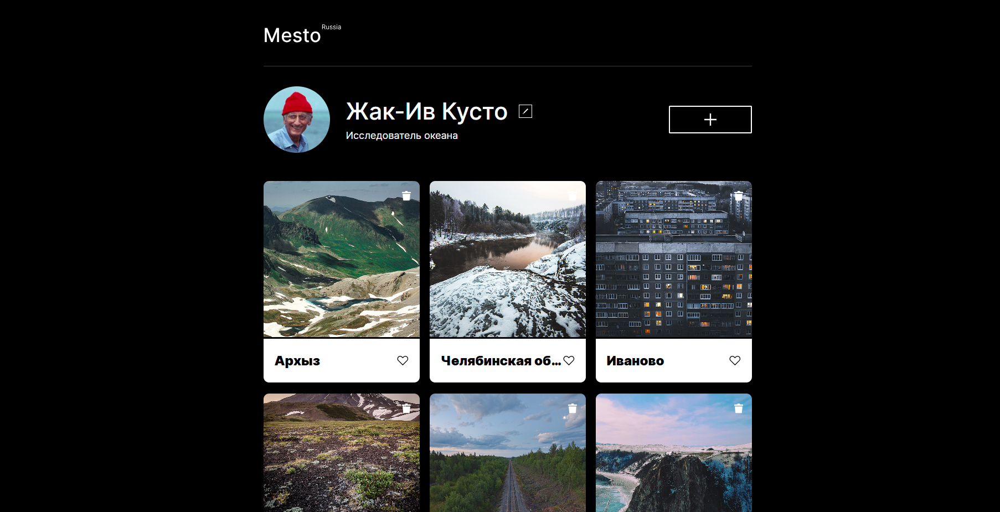

# Проект: Место

### Обзор

**Figma**

* [Ссылка на макет в Figma](https://www.figma.com/file/2cn9N9jSkmxD84oJik7xL7/JavaScript.-Sprint-4?node-id=0%3A1)

## Описание

"Mesto" — интерактивная страница, где пользователь может редактировать профиль, добавлять карточки с фотографиями, ставить лайки и удалять карточки. Проект создан на чистом JavaScript с использованием шаблонов (`<template>`) и модульного подхода.

##  Функциональность

- Открытие и закрытие модальных окон
- Редактирование профиля с подстановкой текущих данных
- Добавление новой карточки через форму
- Лайк карточек
- Удаление карточек
- Просмотр изображений в увеличенном виде
- Анимации открытия и закрытия попапов

## 🛠️ Технологии

- HTML5
- CSS3 
- Vanilla JavaScript (ES6+)
- Работа с DOM
- Семантическая верстка
- Методология БЭМ
